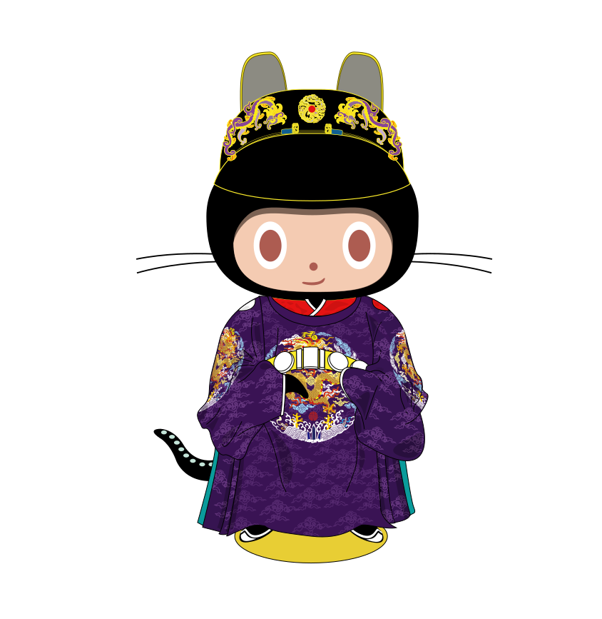

<h2 align="center">Mingtocat</h2>

 

    

    <strong>Mingtocat</strong>, an Octocat designed as a series of roles in the Ming Dynasty of China

 

  

**Mingtocat** is a designed Octocat with clothing of a series of roles in the Ming Dynasty, like emperors, generals or even a common person and what we saw above is one of the informal uniforms. As an open-source, Mingtocat is allowed to download in any picture format: **SVG** / **PNG** / **GIF**, but **business using must be refused**. What the purpose of designing is to make the history of Chinese clothing known by more people all over the world.

### 1. Mingtocat as an emperor clothing with original suits

- [**SVG**](./emperors/origin.svg)
- [**PNG**](./emperors/origin.png)

According to some study, the clothing shown above arose during the later stage of the Ming. In this stage, the colour of the clothing was not only set as yellow, what we normally see. Not only the colour but also the usage of the dermatoglyphic pattern (紋樣) has changed into various. This clothing has been designed based on the artefacts drawn in the picture, named "Ru Bi (入跸圖)". The whole clothing has been divided into five parts: the crown, the robe (袍), the inside clothing (中衣), the belt (帶), and the boots.

#### Crown

There were two "ears" on the crown, and they were called "the Wing of WuSha (烏沙翼)". In the later stage of the Ming Dynasty, the shape of this pair of a wing has become more and more round. Besides, there were some gold pieces of jewellery on the crown, with the meaning of "Double dragons were playing with the same peal".

#### Robe

Besides yellow, purple robe was usually used on an informal occasion. At the shoulder, there were two seals, which were respectively represented for the Sun (日) with red colour on the left side and the Moon (月) with white colour on the right side. A pattern with four encircling dragons (團龍), which was always four, sometimes eight or twelve, were embroidered (繡於) at the middle position and two sleeves. How elegant they were. Notice that the white parts of the inside clothing would be shown a little outside the sleeves named "Chen Bai (襯擺)".

#### Inside Clothing

The collar of the inside clothing was usually dressed into a cross like the character `Y`, which was usually decorated with red or yellow colour.

#### Belt

The belt was mainly designed with jades, and its colour was usually red or yellow. In China, this belt was called "Dai Ting (帶鞓)".

#### Boots

The boots would always be black boots named "Zao Boots (皂靴)".

### References

\[1] 《Q版大明衣冠图志》，董进（撷芳主人），2014
